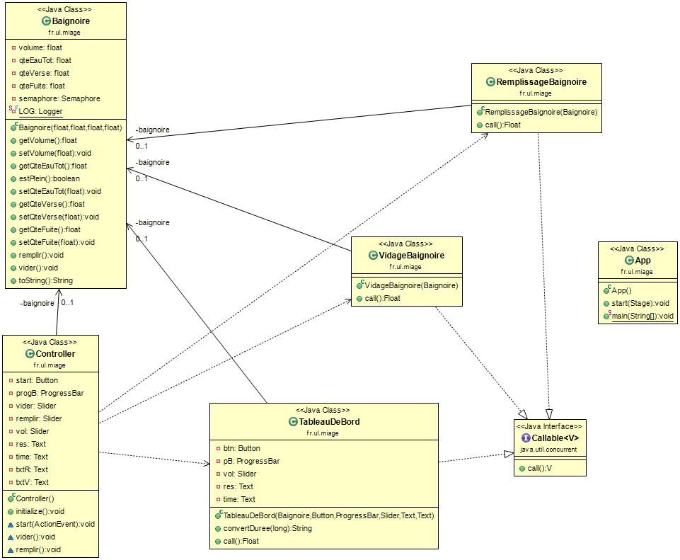

#La documentation technique:

## Les outils :

  Pour ce projet j'ai travaillé avec les outils suivants :

* Scene Builder :outil permettant de réaliser des interfaces JavaFX (version 8).
* Eclipse : IDE pour la programmation Java (jdk 1.8_0241).
* Maven & les plugins nécessaires pour générer les fichiers archives et le fichier binaire (inclus avec cette documentation).
* ObjeAid UML Diagramm : est un outil permettant de créer des diagrammes à partir d'Eclipse.

## Le diagramme de classe :

 

### Explications

Dans le diagramme, il y a les relations suivantes :

* Les classes tableauDeBord, VidageBaignoire et RemplissageBaignoire implémentent l'interface Callable,

* Controller et Baignoire : relation associative entre les deux classes (Instance de Baignoire dans la classe Controller),

* VidageBaignoire et Baignoire : relation associative entre les deux classes (utilisée dans le constructeur),

* RemplissageBaignoire et Baignoire : relation associative entre les deux classes (utilisée dans le constructeur),

* Controller et Log : relation de type use, car la classe Controller ce que contient la classe Log (Instance de Log dans la classe Controller),
* Controller et Session : relation de type use car utilise List<Session>,
* Controller et InfosPerso : relation de type use car utilise List<InfosPerso>, 
* Entre Log et Session : relation de type association, un ou plusieurs logs correspondent à une seule et même session,
* Entre Session et InfosPerso : relation de type association, un utilisateur peut compter 0 ou plusieurs sessions (0 car il se peut qu'en fonction des dates, l'utilisateur ne se soit pas connecté).

## Les classes :

Pour ce TP, j'ai travaillé avec l'interface *Callable* permettant de faire du multithread.

### App.java 

  Cette classe est la classe principale permettant de lancer l'interface (Baignoire.fxml). Il y a deux méthodes :

* start() : permettant de charger le fichier *.fxml*, de modifier le titre de la fenêtre (setTitle()), de spécifier le scène qui va être utilisé (setScene()), d'afficher la scène (commande show()). La taille de la fenêtre n'est pas modifiable (avec setResizable()), ceci évitant de modifier la taille de la fenêtre et l'affichage a été réalisé de la manière la plus simple possible afin de pouvoir l'afficher sur tous les types d'écran (15 pouces, 17 pouces, 19 pouces et inférieur).

* main() : qui permet de charger la fenêtre avec la commande *launch(args)* .

### Controller.java

* initialize() :  est la fonction qui s'exécute lorsque la fenètre FXML se créée.

* start(ActionEvent e) :  est la fonction qui s'exécute lorsque l'on clique sur le bouton "Démarrer". On crée une nouvelle instance de la classe Baignoire nommée baignoire. À l'aide de cette objet Baignoire, on va créer 3 threads qui vont prendre cet objet en paramètres (les paramètres de la baignoire sont récupérées via les sliders) et à l'aide de l'interface CompletionService, on va exécuter ces threads en différer et récupérer leurs résultats.

* remplir() (FXML) : est la fonction qui permet de modifier la quantité d'eau fuitée à l'aide du slider dédiée.La quantité est affichée dans un texte à l'aide de la méthode *setText()*.

* vider() (FXML) : est la fonction qui permet de modifier la quantité d'eau versée à l'aide du slider dédiée.La quantité est affichée dans un texte à l'aide de la méthode *setText()*.

### Baignoire.java 

La classe **Baignoire** contient 6 paramètres :
	* volume (float),
	* qteEauTot (float),
	* qteVerse (float),
	* qteFuite (float),
	* semaphore (classe Semaphore),
	* un élément log (classe Logger) pour les messages d'erreur.

On y a crée le constructeur, les getters et setters ainsi que la méthode toString();

* estPlein() : retourne **true** si la baignoire est vide.

* remplir() : est une fonction qui permet de remplir la baignoire en vérifiant si la quantité d'eau actuelle de la baignoire additionnée à la quantité versée est inférieure ou égale au volume (le volume étant la quantité à atteindre pour que la baignoire soit remplie) alors on incrémente la quantité d'eau.

* vider() : est une fonction qui permet de vider la baignoire en vérifiant si la quantité d'eau actuelle de la baignoire additionnée à la quantité fuitée est inférieure ou égale à 0 (on ne peut pas avoir un volume d'eau négatif) alors on soustrait la quantité d'eau.

### TableauDeBord.java 

* call() : est une méthode appelée afin d'éxécuter une tâche asynchrone, elle retourne un résultat, en cas d'échec de la tâche, elle renvoie une exception (throws Exception).
Dans la classe TableauDeBord, on calcule dans la méthode call le temps que la baignoire met à se remplir et la barre de progression montre l'évolution du volume de l'eau dans la baignoire.

* convertDuree() : permet retourner la durée calculée en minutes et secondes.

### RemplissageBaignoire.java 

* call () **même fonctionnement que expliquer plus haut**, elle boucle tant que la baignoire ne s'est pas remplie totalement et remplira la baignoire en fonction de la quantité saisie avec le slider.

### VidageBaignoire.java 

* call () **même fonctionnement que expliquer plus haut**, elle boucle tant que la baignoire ne s'est pas remplie totalement et videra la baignoire en fonction de la quantité saisie avec le slider.

 Afin de pouvoir mettre à jour les résultats et de pouvoir les visualiser sur l'interface, on utilise la méthode *sleep()*. Tant que la baignoire n'est pas pas pleine, on peut vider la baignoire en appelant la méthode *vider()*.

## Baignoire.fxml 

  Contient tous les éléments de la fenêtre (progressBar, Button, Text, Slider), avec leurs id fxml, leurs positions, les noms et les actions (onAction pour le bouton *Démarrer*).

## Le POM XML 

  Le pom.xml contient le modèle objet pour ce projet. Il contient toutes les informations importantes sur ce projet. Il permet de référencer le groupId, artifactId, version, nom, description, etc. Mais également d'y ajouter des plugins et dépendances pour compiler les ressources du projet permettant d'obtenir le *.bat* ou encore la possibilité de générer des archives (.zip,.rar) avec un *.Jar*.

* Dans le POM.XML, l'encondage est définie en UTF-8.